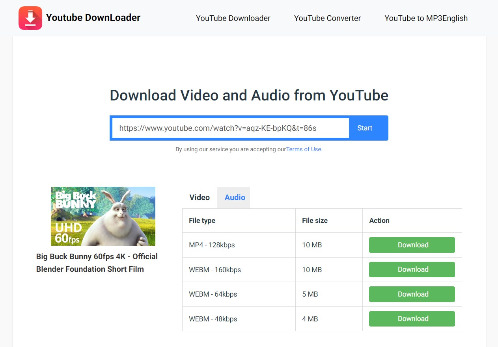
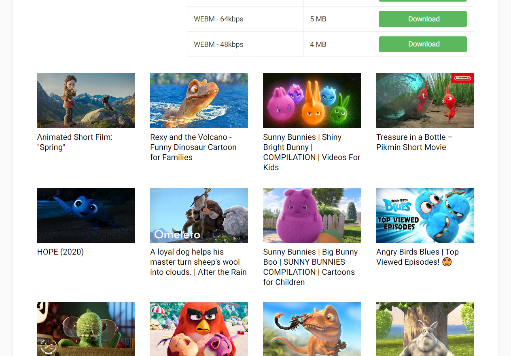

# Youtube downloader

The Y2Mate clone website is a project developed using Next.js, Express.js, Tailwind CSS, Bootstrap, and Node.js. It aims to replicate the functionality of the popular Y2Mate website, which allows users to download videos from various online platforms. By leveraging Next.js for server-side rendering and combining it with Express.js and Node.js for backend functionality, the website offers a seamless video downloading experience.



## Live Demo
You can access the live demo [here](https://youtube-playlists.onrender.com/).

## Description

The Y2Mate clone website provides users with the ability to download videos from platforms such as YouTube, Vimeo, and more. It offers an intuitive and user-friendly interface, similar to the original Y2Mate website, making it easy for users to navigate and download their desired videos.

## Features

- Video Downloading: Users can input the URL of the video they want to download and select the desired format and quality. The website then processes the request and provides the download link.

- Multiple Platform Support: The website supports video downloads from popular platforms like YouTube, Vimeo, and others, allowing users to access a wide range of online content.

- Server-Side Rendering: Next.js is used for server-side rendering, ensuring fast loading times and optimal performance. This results in a smooth and efficient user experience.

- Express.js Backend: Express.js, combined with Node.js, powers the backend functionality of the website. It handles the video processing and download requests, providing a reliable and scalable server environment.

- Responsive Design: The website is designed to be responsive, adapting to different screen sizes and devices. Users can access and use the Y2Mate clone website seamlessly on desktops, tablets, and mobile devices.

- Styling with Tailwind CSS and Bootstrap: Tailwind CSS and Bootstrap are used for styling and layout purposes, offering a visually appealing and responsive interface. These frameworks provide a wide range of pre-designed components and utilities, making the development process more efficient.

## Getting Started

To run the project locally, follow these steps:

1. Clone the repository:

   ```shell
   git clone https://github.com/Emam546/youtube-playlist-server
   ```
2. Install the dependencies:

   ```shell
   npm install
   ```

3. Start the development server:

    ```shell
   npm dev
   ```
****